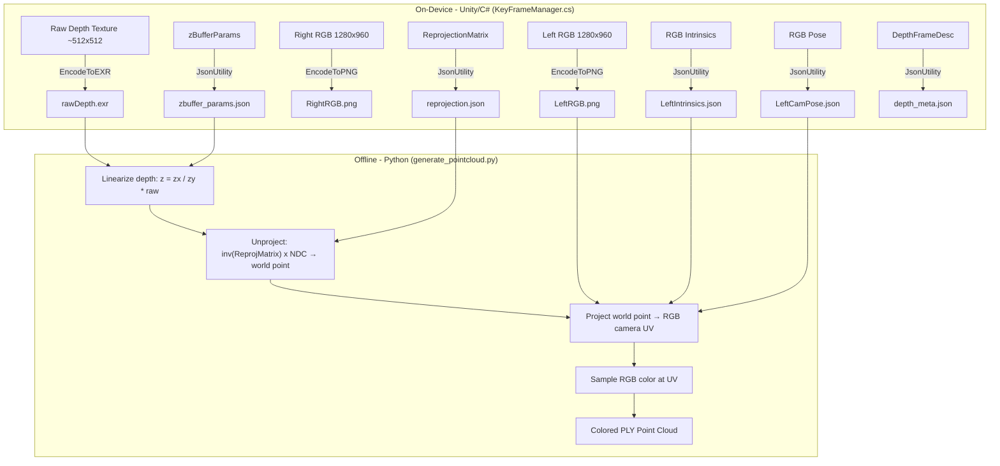

# Plan: Direct 3D Point Cloud from Raw Depth + RGB Color Lookup

## Goal

Replace the iterative depth-registration shader approach with a direct 3D unprojection pipeline:
1. **On-device (Unity/C#):** Capture and save raw depth, RGB, intrinsics, reprojection matrix, and zBuffer params
2. **Offline (Python):** Unproject raw depth pixels to 3D world points, project into RGB camera for color, output colored PLY

---

## Architecture Overview



---

## Part 1: Unity/C# Changes (KeyFrameManager.cs)

### File: `Assets/Scripts/KeyFrameManager.cs`

### Task 1.1: Uncomment raw depth EXR save

At line ~209, the raw depth is already being encoded but the write is commented out:

```csharp
byte[] rawDepthBytes = kf.rawDepth.EncodeToEXR();
//System.IO.File.WriteAllBytes($"{dir}/rawDepth.exr", rawDepthBytes);
```

**Action:** Uncomment the `WriteAllBytes` line.

### Task 1.2: Uncomment reprojection matrix save

At line ~277:

```csharp
//System.IO.File.WriteAllText($"{dir}/reprojection.json", reproj);
```

**Action:** Uncomment this line.

### Task 1.3: Uncomment zbuffer_params save

At line ~278:

```csharp
//System.IO.File.WriteAllText($"{dir}/zbuffer_params.json", zbuf);
```

**Action:** Uncomment this line.

### Task 1.4: Uncomment depth_meta save

At line ~279:

```csharp
//System.IO.File.WriteAllText($"{dir}/depth_meta.json", depthMeta);
```

**Action:** Uncomment this line.

### Task 1.5: (Optional) Remove the registered depth capture

The `SaveRegisteredDepthFrame()` call and the old `depth.exr` save (line ~207) can be removed or left commented since we no longer need the GPU-registered depth. This saves processing time on-device.

Lines to optionally remove/comment:
- Line 97-103: `Texture2D depth = SaveRegisteredDepthFrame(...)`
- Line 207: `System.IO.File.WriteAllBytes($"{dir}/depth.exr", depthBytes);` (already commented)

### Task 1.6: Verify raw depth blit does NOT apply the registration shader

In `SaveDepthFrameRaw()` (line 296-310), the current code does:
```csharp
Graphics.Blit(depthTexArray, rt);
```

This is correct — it's a plain blit with no material, so it copies raw depth values. **No changes needed here.**

### Task 1.7: Save the depth texture resolution explicitly

The depth resolution is already saved in `depth_meta.json` via `kf.depthResolution`. Just verify it matches what `rawDepth.exr` actually is. The raw depth texture is a `Texture2DArray`; the blit extracts slice 0 (left eye). Confirm the saved width/height match.

---

## Part 2: Python Changes (generate_pointcloud.py)

### File: `generate_pointcloud.py`

### Task 2.1: Add Unity Matrix4x4 JSON parser

Unity's `JsonUtility.ToJson(Matrix4x4)` serializes fields as `e00, e01, ..., e33`. These are named row-major (`eRC` = row R, column C) but Unity stores matrices column-major internally. However, when accessing via `eRC`, `e00` is truly row 0 col 0.

```python
def parse_unity_matrix4x4(data):
    """Parse Unity Matrix4x4 JSON → numpy 4x4 array.
    
    Unity Matrix4x4 fields: e00..e33 where eRC means row R, column C.
    This matches standard row-major interpretation.
    """
    M = np.array([
        [data['e00'], data['e01'], data['e02'], data['e03']],
        [data['e10'], data['e11'], data['e12'], data['e13']],
        [data['e20'], data['e21'], data['e22'], data['e23']],
        [data['e30'], data['e31'], data['e32'], data['e33']],
    ], dtype=np.float64)
    return M
```

### Task 2.2: Add new `process_keyframe_direct()` function

This is the core algorithm. Pseudocode:

```
INPUT: rawDepth.exr, LeftRGB.png, LeftIntrinsics.json, LeftCamPose.json, 
       reprojection.json, zbuffer_params.json

1. Load raw depth (H_d × W_d float32), flip Y (Unity EXR stores bottom-up)
2. Load RGB image (H_rgb × W_rgb × 3 uint8), flip Y
3. Load reprojection matrix M (4×4), compute inv_M
4. Load zBuffer params (x, y, z, w)
5. Load RGB intrinsics (fx, fy, cx, cy, sensor_res)
6. Load RGB pose (position, quaternion → rotation matrix)

FOR EACH depth pixel (i, j):
  a. Compute UV:  u = (j + 0.5) / W_d,  v = (i + 0.5) / H_d
  b. Compute NDC: ndc_x = u * 2 - 1,  ndc_y = v * 2 - 1
  c. Linearize:   linear_z = zParams.x / (zParams.y * raw_depth[i,j])
  d. Skip if linear_z < 0.1 or > 15.0
  
  e. Unproject ray via inv_M:
     - p_near = inv_M @ [ndc_x, ndc_y, 1.0, 1.0]  (homogeneous divide)
     - p_far  = inv_M @ [ndc_x, ndc_y, 0.0, 1.0]  (homogeneous divide)
     - ray = p_far - p_near
  
  f. Compute camera z-axis (once, outside loop):
     - center_near = inv_M @ [0, 0, 1, 1]  (dehomogenize)
     - center_far  = inv_M @ [0, 0, 0, 1]  (dehomogenize)
     - cam_z = normalize(center_far - center_near)
     - cam_origin = center_near  (approx, near plane is ~0.2m from camera)
  
  g. Scale ray to match linearized depth:
     - z_component = dot(ray, cam_z)
     - t = linear_z / z_component
     - world_point = cam_origin + t * ray
  
  h. Project world_point into RGB camera:
     - p_local = R_rgb^T @ (world_point - pos_rgb)
     - if p_local.z <= 0: skip (behind camera)
     - sensor_x = (p_local.x / p_local.z) * fx + cx
     - sensor_y = (p_local.y / p_local.z) * fy + cy
  
  i. Apply crop region (sensor → image UV):
     - scale_x = W_rgb / sensor_res_x
     - scale_y = H_rgb / sensor_res_y
     - max_s = max(scale_x, scale_y)
     - scale_x /= max_s;  scale_y /= max_s
     - crop_x = sensor_res_x * (1 - scale_x) * 0.5
     - crop_y = sensor_res_y * (1 - scale_y) * 0.5
     - crop_w = sensor_res_x * scale_x
     - crop_h = sensor_res_y * scale_y
     - u_rgb = (sensor_x - crop_x) / crop_w
     - v_rgb = (sensor_y - crop_y) / crop_h
  
  j. Bounds check: skip if u_rgb or v_rgb outside [0, 1]
  
  k. Sample color:
     - px_x = int(u_rgb * W_rgb)
     - px_y = int(v_rgb * H_rgb)
     - color = rgb[px_y, px_x, :3]
  
  l. Emit: (world_point.x, world_point.y, world_point.z, r, g, b)

OUTPUT: PLY file with all colored 3D points
```

### Task 2.3: Vectorize the implementation

The loop above should be fully vectorized with numpy for performance (depth textures are ~512×512 = 262k pixels per frame). See the reference implementation below.

### Task 2.4: Update main() to use new pipeline

Change `process_keyframe()` calls to `process_keyframe_direct()`. The new function expects:
- `rawDepth.exr` instead of `depth.exr`
- `reprojection.json` and `zbuffer_params.json` (new files)
- Same `LeftCamPose.json` and `LeftIntrinsics.json`

Update the keyframe directory detection to look for `rawDepth.exr` instead of (or in addition to) `depth.exr`.

### Task 2.5: Keep the old pipeline as fallback

Rename existing `process_keyframe()` → `process_keyframe_registered()` and add a CLI flag `--direct` to use the new approach. Default to the new approach.

---

## Part 3: Reference Python Implementation

```python
def process_keyframe_direct(keyframe_dir, min_depth=0.1, max_depth=15.0):
    """
    Direct 3D unprojection: raw depth → world points → RGB color lookup.
    No iterative shader registration needed.
    """
    # --- Load data ---
    raw_depth = iio.imread(os.path.join(keyframe_dir, 'rawDepth.exr'))
    if raw_depth.ndim == 3:
        raw_depth = raw_depth[:, :, 0]
    raw_depth = raw_depth.astype(np.float32)
    raw_depth = raw_depth[::-1, :]  # Unity EXR is bottom-up

    rgb = iio.imread(os.path.join(keyframe_dir, 'LeftRGB.png'))
    rgb = rgb[::-1, :, :]  # Match Y-flip
    H_rgb, W_rgb = rgb.shape[:2]

    with open(os.path.join(keyframe_dir, 'LeftCamPose.json')) as f:
        pose = json.load(f)
    with open(os.path.join(keyframe_dir, 'LeftIntrinsics.json')) as f:
        intr = json.load(f)
    with open(os.path.join(keyframe_dir, 'reprojection.json')) as f:
        reproj_data = json.load(f)
    with open(os.path.join(keyframe_dir, 'zbuffer_params.json')) as f:
        zbuf = json.load(f)

    # --- Parse parameters ---
    M = parse_unity_matrix4x4(reproj_data)
    inv_M = np.linalg.inv(M)

    zx, zy = float(zbuf['x']), float(zbuf['y'])

    fx = float(intr['FocalLength']['x'])
    fy = float(intr['FocalLength']['y'])
    cx = float(intr['PrincipalPoint']['x'])
    cy = float(intr['PrincipalPoint']['y'])
    sx = float(intr['SensorResolution']['x'])
    sy = float(intr['SensorResolution']['y'])

    rgb_pos = np.array([pose['px'], pose['py'], pose['pz']], dtype=np.float64)
    R_rgb = quaternion_to_rotation_matrix(pose['rx'], pose['ry'], pose['rz'], pose['rw'])

    # --- RGB crop region ---
    scale_x = W_rgb / sx
    scale_y = H_rgb / sy
    max_s = max(scale_x, scale_y)
    scale_x /= max_s
    scale_y /= max_s
    crop_x = sx * (1.0 - scale_x) * 0.5
    crop_y = sy * (1.0 - scale_y) * 0.5
    crop_w = sx * scale_x
    crop_h = sy * scale_y

    # --- Depth camera geometry from inverse reproj matrix ---
    def dehomogenize(h):
        return h[:3] / h[3]

    center_near = dehomogenize(inv_M @ np.array([0, 0, 1, 1], dtype=np.float64))
    center_far  = dehomogenize(inv_M @ np.array([0, 0, 0, 1], dtype=np.float64))
    cam_z = center_far - center_near
    cam_z_norm = cam_z / np.linalg.norm(cam_z)
    cam_origin = center_near

    # --- Vectorized depth unprojection ---
    H_d, W_d = raw_depth.shape
    u_coords = (np.arange(W_d, dtype=np.float64) + 0.5) / W_d
    v_coords = (np.arange(H_d, dtype=np.float64) + 0.5) / H_d
    uu, vv = np.meshgrid(u_coords, v_coords)

    ndc_x = (uu * 2 - 1).ravel()
    ndc_y = (vv * 2 - 1).ravel()
    N = len(ndc_x)

    # Linearize depth
    raw_flat = raw_depth.ravel()
    valid = raw_flat > 0.001
    linear_z = np.zeros(N, dtype=np.float64)
    linear_z[valid] = zx / (zy * raw_flat[valid])
    valid &= (linear_z > min_depth) & (linear_z < max_depth)

    # Unproject: near points (reversed-Z: near=1) and far points (far=0)
    ones = np.ones(N, dtype=np.float64)
    zeros = np.zeros(N, dtype=np.float64)

    pts_near_h = inv_M @ np.stack([ndc_x, ndc_y, ones, ones], axis=0)   # 4×N
    pts_near = pts_near_h[:3] / pts_near_h[3:4]                          # 3×N

    pts_far_h = inv_M @ np.stack([ndc_x, ndc_y, zeros, ones], axis=0)   # 4×N
    pts_far = pts_far_h[:3] / pts_far_h[3:4]                             # 3×N

    rays = pts_far - pts_near  # 3×N

    # Scale each ray by depth / z-component
    z_components = cam_z_norm @ rays  # N (dot product)
    
    # Avoid division by zero
    valid &= np.abs(z_components) > 1e-6
    
    t_scale = np.zeros(N, dtype=np.float64)
    t_scale[valid] = linear_z[valid] / z_components[valid]

    # World points (only compute valid ones)
    world_pts = cam_origin[:, None] + t_scale[None, :] * rays  # 3×N
    world_pts = world_pts[:, valid].T  # N_valid × 3

    # --- Project into RGB camera ---
    p_local = (R_rgb.T @ (world_pts - rgb_pos).T)  # 3 × N_valid

    # Only keep points in front of RGB camera
    in_front = p_local[2] > 0.01
    p_local = p_local[:, in_front]
    world_pts = world_pts[in_front]

    # Pinhole projection
    sensor_x = (p_local[0] / p_local[2]) * fx + cx
    sensor_y = (p_local[1] / p_local[2]) * fy + cy

    # Sensor → image UV via crop
    u_rgb = (sensor_x - crop_x) / crop_w
    v_rgb = (sensor_y - crop_y) / crop_h

    # Bounds check
    in_bounds = (u_rgb >= 0) & (u_rgb < 1) & (v_rgb >= 0) & (v_rgb < 1)
    u_rgb = u_rgb[in_bounds]
    v_rgb = v_rgb[in_bounds]
    world_pts = world_pts[in_bounds]

    # Sample RGB (nearest neighbor)
    px_x = np.clip((u_rgb * W_rgb).astype(int), 0, W_rgb - 1)
    px_y = np.clip((v_rgb * H_rgb).astype(int), 0, H_rgb - 1)
    colors = rgb[px_y, px_x, :3]

    return world_pts.astype(np.float32), colors.astype(np.uint8)
```

---

## Part 4: Validation & Debugging

### Task 4.1: Print diagnostic info

Add a `--diag` mode that prints for each keyframe:
- Reprojection matrix (all 4 rows)
- Computed camera origin and z-axis from `inv(M)`
- zBuffer params and sample linearized depths (min, mean, max)
- Number of valid depth pixels
- Number of points that successfully project into RGB bounds
- Percentage coverage (how many depth pixels got a color)

### Task 4.2: Sanity checks

- Camera origin from `inv(M)` should be close to the head position (`GetNodePoseState(Head)`) — not exactly the RGB camera position (which is offset ~3cm to the side)
- Linearized depth values should be in range ~0.2–10m for typical indoor scenes
- The cam_z_norm direction should roughly point "forward" from the head

### Task 4.3: Handle edge cases

- If `zy` in zBufferParams is 0, skip the frame
- If `inv_M` produces NaN/Inf (degenerate matrix), skip
- If fewer than 10% of depth pixels produce valid colored points, log a warning

---

## File Changes Summary

| File | Action |
|------|--------|
| `Assets/Scripts/KeyFrameManager.cs` | Uncomment 4 lines (rawDepth.exr, reprojection.json, zbuffer_params.json, depth_meta.json) |
| `generate_pointcloud.py` | Add `parse_unity_matrix4x4()`, add `process_keyframe_direct()`, update `main()` |

---

## Important Notes for the Implementer

1. **Y-flip convention:** Unity's `EncodeToEXR()` stores row 0 at the bottom. When loading in Python with imageio, row 0 is at the top. Always flip with `[::-1, :]`. The same applies to PNG.

2. **Reversed-Z depth:** Meta Quest uses reversed-Z (near=1.0, far=0.0 in NDC). When unprojecting, `ndc_z = 1.0` is the near plane, `ndc_z = 0.0` is the far plane.

3. **Depth linearization formula:** `linear_z = zParams.x / (zParams.y * rawDepth)`. Typical values: `zParams = (-0.20, -1.00, 0, 0)` → `linear_z = 0.20 / rawDepth`.

4. **Matrix4x4 JSON format:** Unity serializes as `{e00, e01, ..., e33}`. The naming convention is `eRowCol`. This is standard row-major layout.

5. **Crop region:** The Quest 3 RGB camera has a 1280×1280 sensor but captures at 1280×960 (cropped 160px top and bottom). The intrinsics (`cx`, `cy`, `fx`, `fy`) are in full sensor-pixel coordinates, so you must apply the crop offset when converting from sensor coords to image UV.

6. **Occlusion at edges:** ~10-20% of depth points may not have valid RGB (wider FOV on depth than RGB). This is expected — just skip those points.

7. **ReprojMatrix timing:** The saved reproj matrix includes a temporal correction for head motion between depth capture and render time. For static scenes this is fine. For dynamic scenes, there may be slight misalignment.
